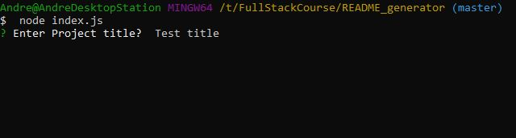
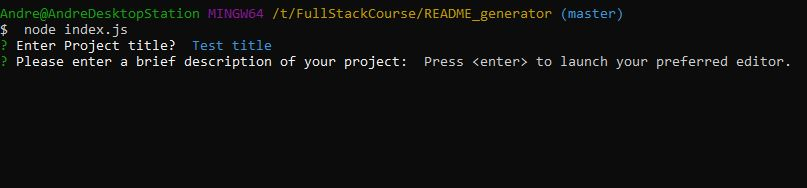
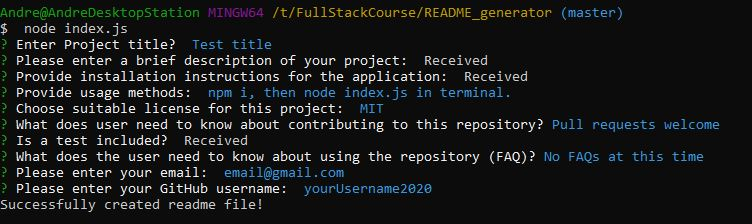

# Top-Tier README Generator

When creating an open-source project on GitHub, it's a necessaity to ensure you have a clear and easy to follow README file with app information -- what is it for, how to use the app, how to install it, how to report issues etc. This helps streamline the use of the project and encourage other developers to contribute. It can be quite a time-sink to properly create and format the readme, so this generator is here to step in and bridge the gap. You can now spend less time on the README, and more time on your project!

## Contents

- [Installation](#installation)
- [User Story](#user-story)
- [Usage](#usage)
- [Demonstration](#demonstration)
- [Screenshots](#screenshots)
- [Questions](<#questions-(FAQ)>)
- [Contact](#contact)
- [Author](#authors)
- [Acknowledgements](#acknowledgements)

## Installation

1. Use

```javascript
  npm install
```

to install inquirer.js package 2. Ensure you have a command line terminal to use

## User Story

```
AS A developer
I WANT a README generator
SO THAT can quickly create a professional README for a new project
```

## Usage

- [Tutorial-Video]()

- Use the below in the terminal to initiate the program.

```javascript
  node index.js
```

- When prompted to open an editor, press "enter".
- Using the default text editor (Which can be changed by editing the $EDITOR and $VISUAL environment variables)
  - On windows: notepad
  - On mac: textpad
- Type what the editor has prompted, and do not save the document when you close it.
- Once all prompts are complete, the readme will be written to the generatedReadme folder.

## Screenshots

_Initiate application from root directory in the terminal_


_Follow initial prompts_


_Follow your computer environments browser prompts_


_Use your local editor in the specifically requesting prompts for ease of experience_


_Select licenses using spacebar, and enter to submit_


_Complete readme generation_


_Sample of completed readme_


## Questions (FAQ)

- The app runs in command-line. There is no GUI.
- You only require the inquirer.js package for node.js.
- This project is made to simplify the readme writing process, it isn't a permanent substitute.

## Contact

- Contact me with any questions on my email: agre.fun21@gmail.com or silver.grech@gmail.com

## Author

- Code from scratch by Andr&eacute; Grech - 24/09/2020

## Acknowledgements

- © 2019 Trilogy Education Services, a 2U, Inc. brand. All Rights Reserved.
